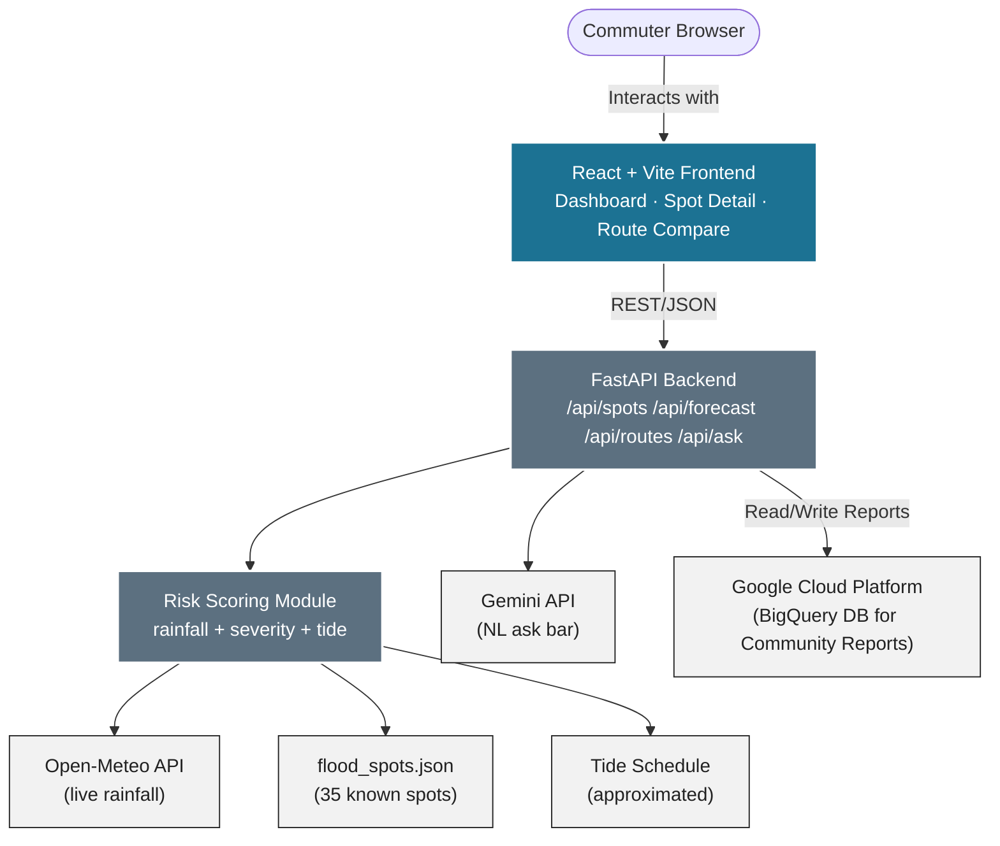

# 🌧️ Rasta Radar

**Know Before You Go — Not After You're Stuck.**

[](LICENSE)
[](https://github.com/M0izz/Rasta-Radar/pulls)
[](https://fastapi.tiangolo.com/)
[](https://react.dev/)
[](https://ai.google.dev/)

A hyperlocal waterlogging and commute advisory for Mumbai, built for the **Gen AI Academy — APAC Edition** hackathon. Every monsoon, commuters find out a street is flooded only after they're stuck on it — Rasta Radar tells you before you leave.

⭐ **If you find this useful or you're a fellow hackathon builder, consider starring the repo — it helps it get seen.** ⭐

**[Live Demo](https://rasta-radar.vercel.app)** · **[Report a Bug](https://github.com/M0izz/Rasta-Radar/issues)**

---

## 📖 Table of Contents

- [Vision](#-vision)
- [Key Features](#-key-features)
- [Tech Stack](#️-tech-stack)
- [Architecture Diagram](#-architecture-diagram)
- [Risk Scoring Formula](#-risk-scoring-formula)
- [Getting Started](#-getting-started)
- [Project Structure](#-project-structure)
- [Known Limitations](#-known-limitations)
- [Roadmap](#️-roadmap)
- [Contributing](#-contributing)
- [License](#️-license)

---

## 🚀 Vision

City-wide flood alerts tell you it's raining somewhere in Mumbai. They don't tell you whether *your* junction, on *your* route, is actually a problem right now.

Rasta Radar closes that gap — combining live rainfall data, a curated database of historically known Mumbai flood spots, and tide timing into a transparent, explainable risk score. No black-box predictions: every score can be traced back to the exact rainfall, severity, and tide numbers that produced it.

---

## 🌟 Key Features

- 🗺️ **Live Risk Dashboard** — A color-coded map of known flood spots across Mumbai, ranked by current risk, with a "leave by" time for the ones that matter right now.
- 💬 **Ask in Plain Language** — *"Will Andheri Subway flood by 6pm?"* — answered by the Gemini API, grounded strictly in real risk data. It never invents a spot that isn't in the dataset.
- ⏱️ **Forecast Slider** — Scrub forward through the next few hours of forecast rainfall to watch risk build across the evening, not just see a single snapshot.
- 🔀 **Route Comparison** — Pick two named routes and see which one passes fewer high-risk spots, with a plain-language recommendation.
- ✅ **Community Confirm/Deny** — Anyone nearby can mark a spot "still flooded" or "clear now," keeping the data grounded in what's actually happening on the ground.
- 🔍 **Transparent by Design** — The risk formula is shown in the open, not hidden behind an opaque model. See [Risk Scoring Formula](#-risk-scoring-formula).

---

## 🏗️ Tech Stack

| Layer | Technology | Purpose |
|---|---|---|
| **Frontend** | React + Vite | Fast, component-based UI |
| **Mapping** | Leaflet.js | Interactive risk map rendering |
| **Backend** | FastAPI (Python) | Risk scoring engine, REST API |
| **Database** | Google Cloud BigQuery | Persistent storage for community reports & flood logs |
| **Weather Data** | Open-Meteo API | Live + forecast rainfall for Mumbai |
| **AI** | Gemini API | Grounded natural-language ask bar |
| **Hosting** | Vercel | Unified frontend & backend deployment |

---

## 📐 Architecture Diagram



---

## 🧮 Risk Scoring Formula

```
risk_score = (rainfall_last_3h_mm × 0.6)
           + (historical_severity × 0.3 × 20)
           + (tide_proximity_bonus × 0.1 × 100)
```

- Normalized to a 0–100 scale
- **Low** < 33 · **Moderate** 33–66 · **High** > 66
- `tide_proximity_bonus` = 1 if within ±2 hours of Mumbai high tide, else 0

---

## 🏃 Getting Started

### Prerequisites

- [Python](https://www.python.org/) 3.9+
- [Node.js](https://nodejs.org/) 18+
- A [Gemini API key](https://ai.google.dev/) (optional — enables the ask bar)
- GCP Credentials (optional — enables BigQuery community report persistence)

### Backend

```bash
git clone https://github.com/M0izz/Rasta-Radar.git
cd Rasta-Radar/backend

pip install -r requirements.txt

# Optional: enables BigQuery persistence & Gemini ask bar
copy .env.example .env
# then edit .env and add your keys
```

```bash
uvicorn main:app --reload
```

Backend runs at **http://localhost:8000**

### Frontend

```bash
cd ../frontend
npm install
npm run dev
```

Frontend runs at **http://localhost:5173**

---

## 📁 Project Structure

```
Rasta-Radar/
├── backend/
│   ├── main.py              # FastAPI app, route definitions
│   ├── risk_scoring.py      # Risk formula + leave-by logic
│   ├── gemini_service.py    # Gemini NL ask bar integration
│   ├── flood_spots.json     # 35 known Mumbai flood spots
│   ├── requirements.txt
│   └── .env.example
├── frontend/
│   └── src/
│       ├── components/      # Map, RiskCard, AskBar, AlertBanner, ForecastSlider
│       ├── pages/           # Dashboard, SpotDetail, RouteCompare
│       └── api/             # Fetch wrappers to the backend
└── vercel.json
```

---

## ⚠️ Known Limitations

Being upfront about what this is — and isn't — matters more to us than looking polished:

- **Not a calibrated prediction model.** The risk score is a transparent heuristic, not trained against historical flood outcomes.
- **Tide schedule is approximated** from a reference date and a fixed ~12h25m period — not synced with official IMD tide tables.
- **Route comparison uses labeled associations** (which known spots a route passes near), not real turn-by-turn routing.

## 🗺️ Roadmap

- [x] Persistent storage for community confirm/deny votes (integrated with GCP BigQuery)
- [ ] Real turn-by-turn routing (OSRM / Google Directions)
- [ ] Sync tide schedule with official IMD data
- [ ] Calibrate the risk model against historical flood outcomes as ground-truth data becomes available

---

## 🤝 Contributing

Rasta Radar is open to contributions from the community!

1. Fork the project
2. Create your feature branch (`git checkout -b feature/AmazingFeature`)
3. Commit your changes (`git commit -m 'feat: add some AmazingFeature'`)
4. Push to the branch (`git push origin feature/AmazingFeature`)
5. Open a Pull Request

---

## 🛡️ License

This project is licensed under the MIT License — see [LICENSE](LICENSE) for details.

*Built for the Gen AI Academy — APAC Edition hackathon.*
